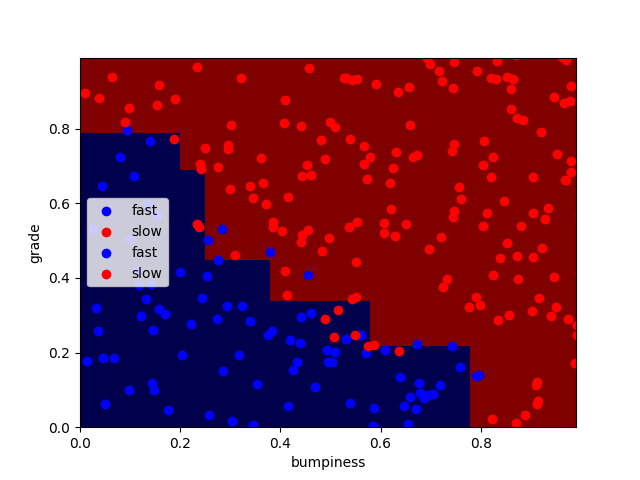
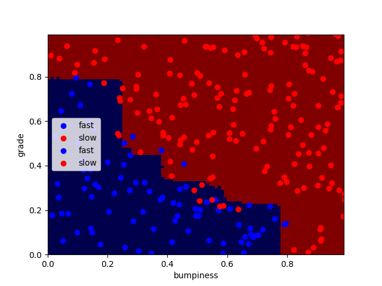

### Machine Learninig Algoritms.

Testing different Classifiers.

1. KNeighborsClassifier
2. AdaBoostClassifier
3. RandomForestClassifier

### KNeighborsClassifier
Results for KNeighborsClassifier. 
Accuracy : 0.94 

### AdaBoostClassifier 
Results for AdaBoostClassifier. 
Accuracy : 0.928 

### RandomForestClassifier  
Results for RandomForestClassifier. 
Accuracy : 0.924 

